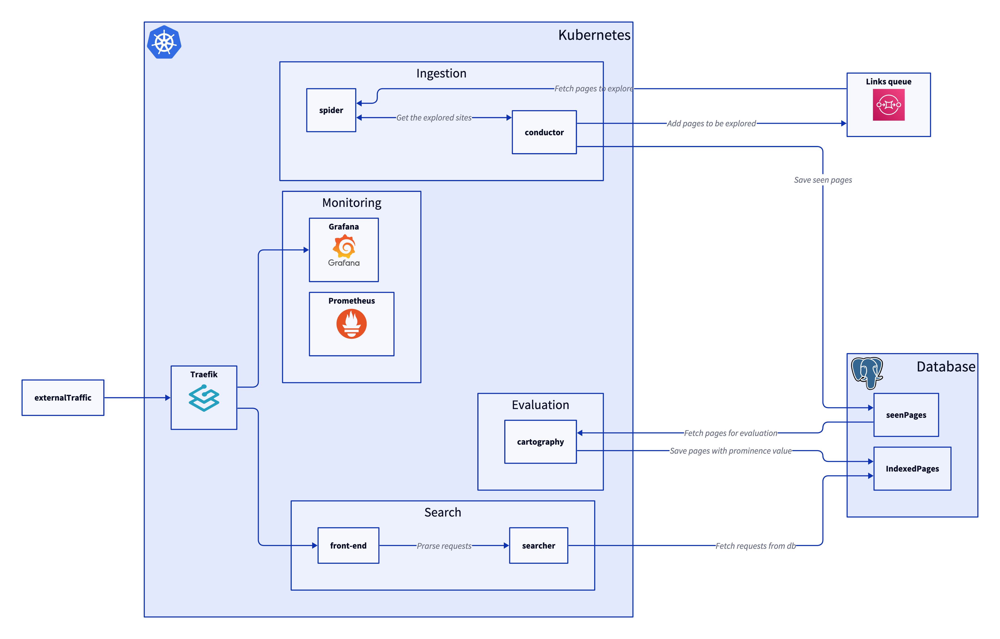
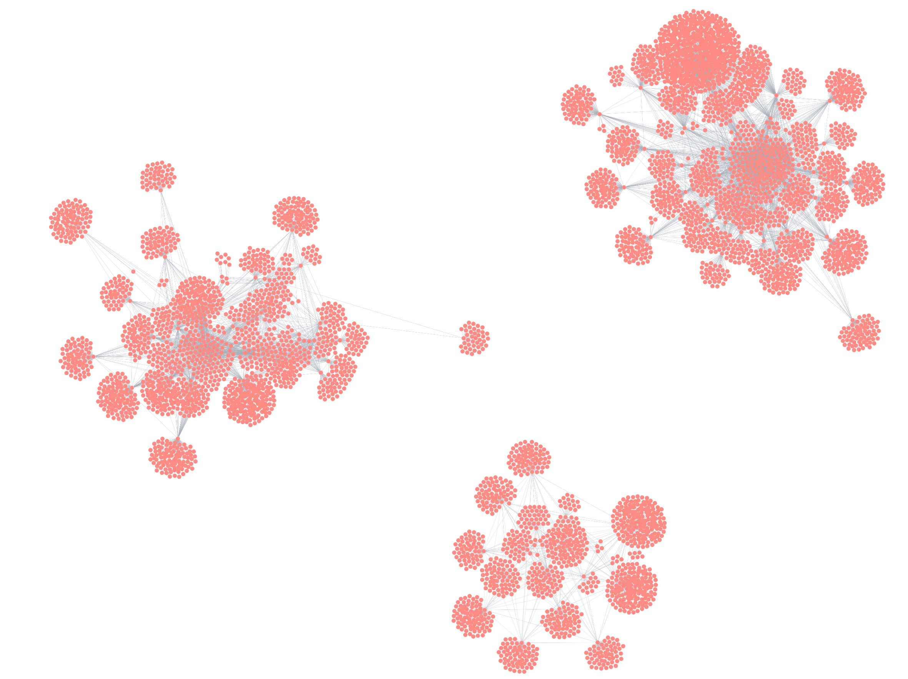

# Go SearchEngine 🕷️

## Overview 🌐

### 1. Spider

This goes to websites and finds new ones it uses a local SqliteDB then sends a stream to the conducto then sends a stream to the conductor

### 2. Conductor
Accepts a stream the spiders of websites which have been explored and sees if they have already been seen recently
The conductor also communicates with the spider to give back off commands if the conductor cannot keep up with the conductor.

### 3. Cartographer
The role of this more complex. This is used to create a view of the pages and see which are linking to each other.
Because the graph is so large we can not load the whole thing so in order to avoid this we load a section and traverse
that.
We can then use this list to generate list of the more important pages

### 4. Front-end
This front end which allows for the Database to be searched

