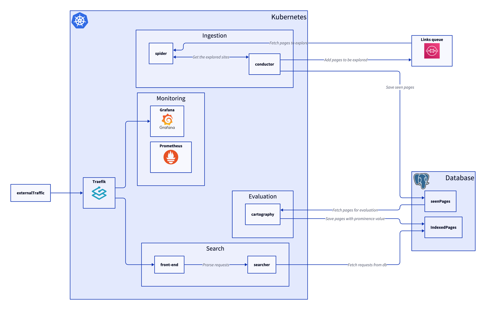
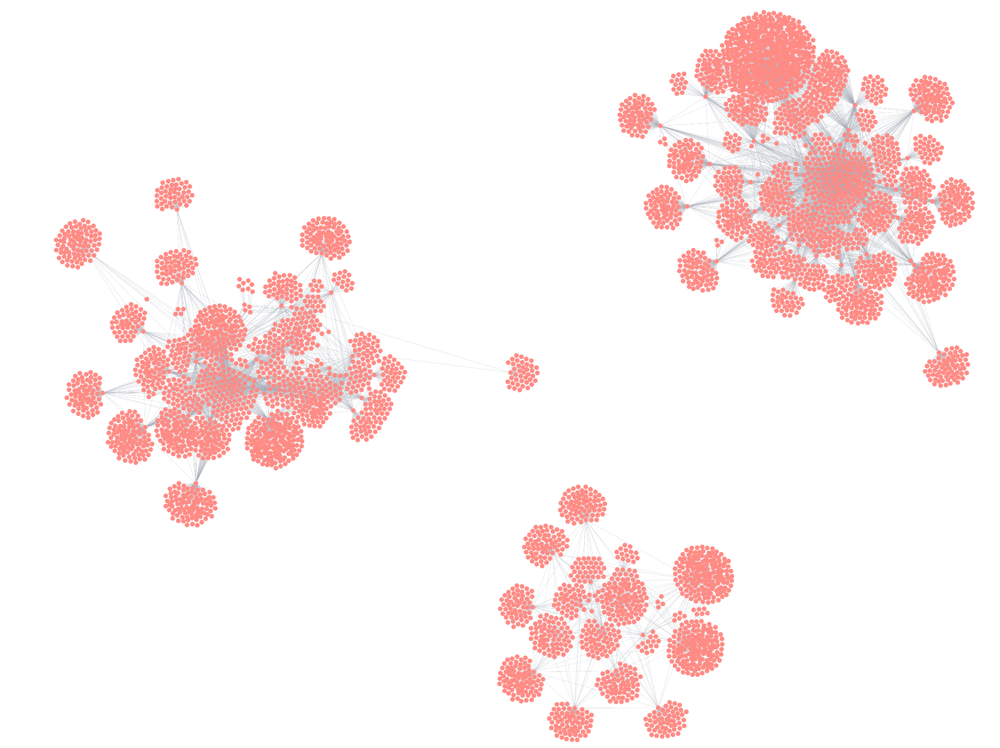

# Go SearchEngine 🕷️
[](https://github.com/Acollie/Go-Webcrawler/actions/workflows/go.yml)



## Overview 🌐

### 1. Spider
This goes to websites and finds new ones it uses a local SqliteDB then sends a stream to the conductor.

### 2. Conductor
Accepts a stream from the spiders of websites which have been explored and checks if they have already been seen recently.
The conductor also communicates with the spider to give back-off commands if the conductor cannot keep up.

### 3. Cartographer
Computes PageRank scores for web pages using a damped PageRank algorithm with a damping factor of 0.85.
Because the graph is so large we cannot load the whole thing, so we randomly sample pages and run multiple sweeps.
PageRank results are stored in a versioned table with timestamps and the `is_latest` flag.
Runs as a Kubernetes CronJob every 6 hours.

### 4. Searcher
Search service that queries the database using PostgreSQL full-text search (GIN indices with tsvector).
Results are boosted using PageRank scores from the Cartographer service.
Provides gRPC endpoints for querying pages.

### 5. Front-end
This front end which allows for the Database to be searched.

## Protocol Buffers (gRPC) 📡

### Proto File Structure

The project uses Protocol Buffers for service definitions and data types:

```
protos/
├── service/          # Service definitions
│   └── spider.proto  # Spider and Searcher service APIs
└── types/           # Shared message types
    └── site.proto   # Common data structures
```

### Services Defined

**Spider Service** (`protos/service/spider.proto`)
- `GetSeenList`: Stream of seen pages from the spider
- `GetHealth`: Health check endpoint

**Searcher Service** (`protos/service/spider.proto`)
- `SearchPages`: Query pages with full-text search

### Generating Proto Code

The Makefile provides commands to generate Go code from all `.proto` files:

```bash
# Generate Go code from all proto files
make proto_gen

# List all proto files that will be generated
make proto_list

# Clean generated proto files
make proto_clean
```

Generated files are placed in `pkg/generated/` with the following structure:
```
pkg/generated/
├── service/
│   └── spider/
│       ├── spider.pb.go       # Message types
│       └── spider_grpc.pb.go  # gRPC service code
└── types/
    └── site/
        └── site.pb.go         # Common types
```

### Adding New Proto Files

To add new service definitions:

1. Create your `.proto` file in the appropriate directory:
   - `protos/service/` for service definitions
   - `protos/types/` for shared message types

2. Ensure you specify the correct package and go_package:
```protobuf
syntax = "proto3";
package service;
option go_package = "service/your_service";
```

3. Run `make proto_gen` to generate Go code

4. Import the generated code in your service:
```go
import (
    pb "webcrawler/pkg/generated/service/your_service"
)
```

The Makefile will automatically find and generate all `.proto` files in the `protos/` directory tree

## Mock Generation (Testing) 🧪

### Overview

The project uses [Mockery](https://vektra.github.io/mockery/) to automatically generate mocks for all gRPC service interfaces. These mocks are essential for unit testing services without requiring actual gRPC connections.

### Generated Mocks

Mocks are generated for both client and server interfaces:

- **SpiderClient** - Mock for testing code that calls the Spider service
- **SpiderServer** - Mock for testing Spider service implementations
- **SearcherClient** - Mock for testing code that calls the Searcher service
- **SearcherServer** - Mock for testing Searcher service implementations

### Generating Mocks

```bash
# Generate mocks for all gRPC services
make mock_gen

# List which interfaces will be mocked
make mock_list

# Clean generated mocks
make mock_clean

# Generate both protos and mocks in one command
make gen

# Clean both protos and mocks
make clean
```

### Mock Location

Generated mocks are placed in:
```
pkg/mocks/
└── service/
    └── spider/
        ├── SpiderClient.go
        ├── SpiderServer.go
        ├── SearcherClient.go
        └── SearcherServer.go
```

### Using Mocks in Tests

Mocks are generated with the **expecter pattern** for type-safe test assertions:

```go
import (
    "testing"
    "github.com/stretchr/testify/mock"
    mockspider "webcrawler/pkg/mocks/service/spider"
    pb "webcrawler/pkg/generated/service/spider"
)

func TestSearchService(t *testing.T) {
    // Create mock client
    mockClient := mockspider.NewMockSearcherClient(t)

    // Setup expectations using the expecter pattern
    mockClient.EXPECT().
        SearchPages(mock.Anything, mock.Anything).
        Return(&pb.SearchResponse{
            Pages: []*pb.Page{{Url: "https://example.com"}},
        }, nil).
        Once()

    // Use the mock in your test
    resp, err := mockClient.SearchPages(context.Background(), &pb.SearchRequest{
        Query: "test",
        Limit: 10,
    })

    // Assertions
    assert.NoError(t, err)
    assert.Len(t, resp.Pages, 1)

    // Verify all expectations were met
    mockClient.AssertExpectations(t)
}
```

### Prerequisites

Install mockery if not already installed:

```bash
go install github.com/vektra/mockery/v2@latest
```

The Makefile will automatically check if mockery is installed and provide installation instructions if needed.

### Configuration

Mock generation is configured in `.mockery.yaml`. To add mocks for new services:

1. Generate your proto files first: `make proto_gen`
2. Add the new interface to `.mockery.yaml`
3. Run `make mock_gen`

Example configuration:
```yaml
packages:
  webcrawler/pkg/generated/service/your_service:
    interfaces:
      YourServiceClient:
        config:
          dir: "pkg/mocks/service/your_service"
      YourServiceServer:
        config:
          dir: "pkg/mocks/service/your_service"
```

