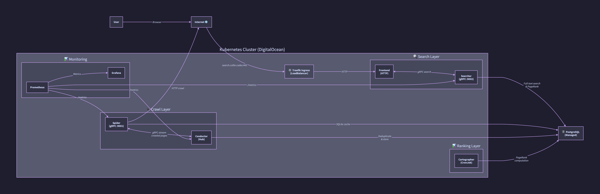
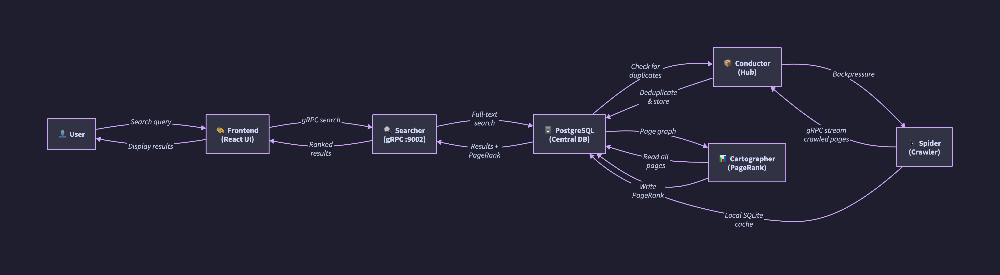
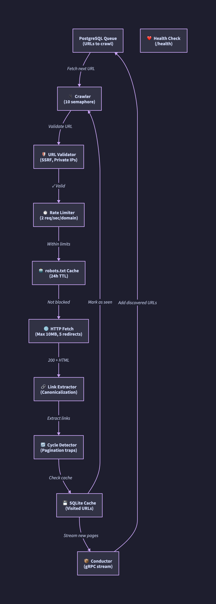
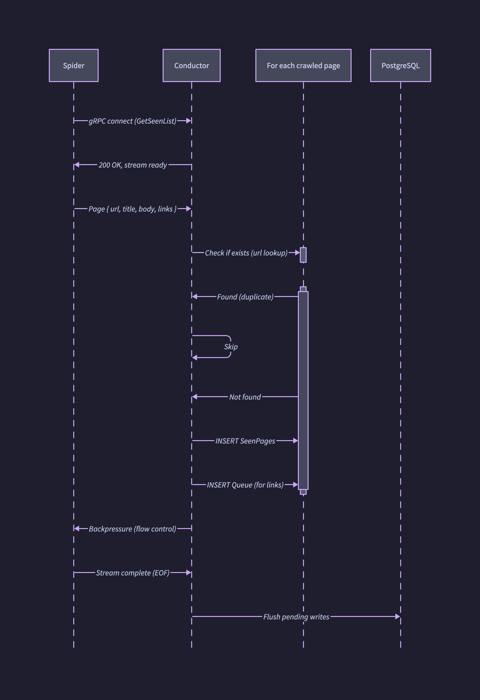
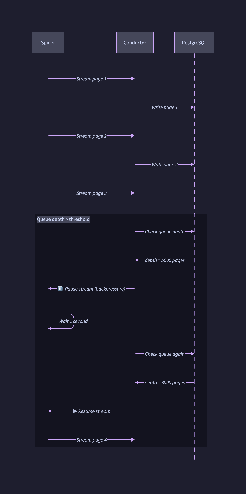

# Distributed Web Search Engine

[](https://github.com/Acollie/Go-Webcrawler/actions/workflows/go.yml)
[](https://go.dev)
[](https://postgresql.org)
[](https://kubernetes.io)
[](https://grpc.io)
[](https://prometheus.io)

**[🌐 Live Demo → search.collie.codes](https://search.collie.codes)** &nbsp;·&nbsp; **[📊 Metrics → metrics.collie.codes](https://metrics.collie.codes)**

Five Go microservices crawling the web, ranking pages with a custom PageRank implementation, and serving sub-100ms full-text search — deployed live on Kubernetes with auto-scaling, TLS, and a full Prometheus/Grafana observability stack.




---

## What Makes This Interesting

| Challenge | Approach |
|-----------|----------|
| **Relevance ranking** | Custom PageRank (damping 0.85, 100K pages/sweep) fused with PostgreSQL full-text: `score = (text × 0.3) + (pagerank × 0.7)` |
| **SSRF protection** | Crawler validates every URL against private CIDRs, cloud metadata endpoints (AWS/Azure/GCP), and re-resolves DNS to defeat rebinding attacks |
| **Backpressure** | Spider↔Conductor use gRPC bidirectional streaming; Conductor signals throttle back when queue depth rises |
| **Auto-scaling** | Spider HPA scales 1→10 replicas on CPU (70%) and memory (80%) thresholds — no manual intervention |
| **Zero-downtime deploys** | Rolling updates + Pod Disruption Budgets across all services |
| **Observability** | Every service exports Prometheus metrics; Grafana dashboards alert on error rate, queue depth, and p95 latency |

---

## Architecture

Five services, one database, no message broker.

```
Spider ──gRPC stream──► Conductor ──► PostgreSQL ◄── Cartographer (CronJob, 6h)
                                           │
                          Searcher ◄───────┘
                              │
                          Frontend ◄── User
```

| Service | Role |
|---------|------|
| **Spider** | Crawls the web with SSRF protection, robots.txt caching, cycle detection, and per-domain rate limiting. Streams pages to Conductor over gRPC. |
| **Conductor** | Receives the stream, deduplicates against PostgreSQL, and manages the crawl queue. Applies backpressure when overwhelmed. |
| **Cartographer** | Runs PageRank over the full page graph on a 6-hour Kubernetes CronJob. Writes versioned, timestamped results. |
| **Searcher** | Combines PostgreSQL GIN full-text search with PageRank scores into a single ranked result set. |
| **Frontend** | React search UI — search box, paginated results, latency metrics. |

### Diagrams

<details>
<summary>Spider crawling pipeline</summary>


</details>

<details>
<summary>gRPC bidirectional streaming</summary>


</details>

<details>
<summary>Backpressure / back-off</summary>


</details>

Source D2 files: `assets/diagrams/`

---

## Key Technical Details

### PageRank (Cartographer)

- **Damping factor**: 0.85 (standard web setting)
- **Sampling**: 100 sweeps × 100K random pages — avoids loading the full graph into memory
- **Versioning**: `is_latest` flag on `PageRankResults` table; stale sweeps retained for historical analysis
- **Convergence**: threshold 0.0001, max 20 iterations per sweep

### Search Scoring (Searcher)

```
Final Score = (ts_rank(search_vector, query) × 0.3) + (pagerank_score × 0.7)
```

PostgreSQL `tsvector` + GIN index handles full-text; PageRank provides the long-term authority signal.

### Spider Security

- **SSRF**: Blocks `10.0.0.0/8`, `172.16.0.0/12`, `192.168.0.0/16`, loopback, link-local, and cloud metadata endpoints (AWS `169.254.169.254`, Azure `169.254.169.253`, GCP `metadata.google.internal`)
- **DNS rebinding defence**: Resolves hostnames post-validation to catch late-binding attacks
- **Rate limiting**: 2 req/sec per domain, burst 5
- **robots.txt caching**: 24h TTL — ~1000× reduction in redundant fetches
- **Resource caps**: 10MB response limit, max 5 redirects, Content-Type validation, semaphore (max 10 concurrent fetches)

### Infrastructure

- **Kubernetes on DigitalOcean**: Namespace isolation, RBAC, non-root containers, read-only root filesystems
- **HPA**: Spider scales 1→10 replicas automatically
- **Traefik ingress**: TLS termination + auto cert renewal via Let's Encrypt
- **Connection pooling**: 25 max / 5 idle / 5m lifetime across all services
- **Monitoring**: Prometheus + Grafana with alerts for `ServiceDown`, `HighErrorRate >10%`, `SpiderQueueDepth >50K`, `SearcherLatency p95>1s`

---

## Performance

| Service | Throughput | Bottleneck |
|---------|-----------|------------|
| Spider | 10 concurrent crawls per replica (×10 replicas) | Network latency |
| Conductor | ~1,000 pages/sec | PostgreSQL write throughput |
| Cartographer | 100K pages/sweep | Random sampling (memory-efficient) |
| Searcher | <100ms p95 | GIN index + query cache |

### Database Indices

```sql
CREATE INDEX idx_pages_url       ON SeenPages(url);
CREATE INDEX idx_pages_search    ON SeenPages USING GIN(search_vector);
CREATE INDEX idx_pagerank_latest ON PageRankResults(is_latest);
CREATE INDEX idx_pagerank_scores ON PageRankResults(score DESC);
CREATE INDEX idx_queue_url       ON Queue(url);
```

---

## Development

### Prerequisites

- Go 1.24+
- PostgreSQL 12+
- Docker (integration tests use testcontainers)
- `protoc` and `mockery` for code generation

### Commands

```bash
# Generate protobuf code and mocks
make gen

# Run all tests
go test ./...

# Run with coverage
go test -cover ./...

# Lint (revive)
make lint

# Build Docker images
make buildSpider
make buildConductor
```

### Running Locally

```bash
export DB_USER=postgres DB_PASSWORD=yourpassword DB_HOST=localhost DB_NAME=databaseName

go run cmd/spider/main.go
go run cmd/conductor/main.go
go run cmd/cartographer/main.go
go run cmd/searcher/main.go
```

### Code Generation

```bash
make proto_gen   # Compile .proto → Go (pkg/generated/)
make mock_gen    # Generate testify mocks (pkg/mocks/)
make proto_list  # List proto files to be processed
make clean       # Remove all generated files
```

### Testing Patterns

Mocks use the expecter pattern for type-safe assertions:

```go
mockClient := mockspider.NewMockSearcherClient(t)
mockClient.EXPECT().
    SearchPages(mock.Anything, mock.Anything).
    Return(&pb.SearchResponse{Pages: []*pb.Page{{Url: "https://example.com"}}}, nil).
    Once()
```

Integration tests spin up real PostgreSQL via testcontainers — no mocked databases.

---

## Stack

Go · gRPC · Protocol Buffers · PostgreSQL · Kubernetes · Prometheus · Grafana · Traefik · React · TailwindCSS · Docker · DigitalOcean · D2

---

## References

- [PageRank Algorithm](https://en.wikipedia.org/wiki/PageRank)
- [PostgreSQL Full-Text Search](https://www.postgresql.org/docs/current/textsearch.html)
- [gRPC Go](https://grpc.io/docs/languages/go/)
- [Protocol Buffers](https://developers.google.com/protocol-buffers)

---

## License

MIT — see [LICENSE](LICENSE)
